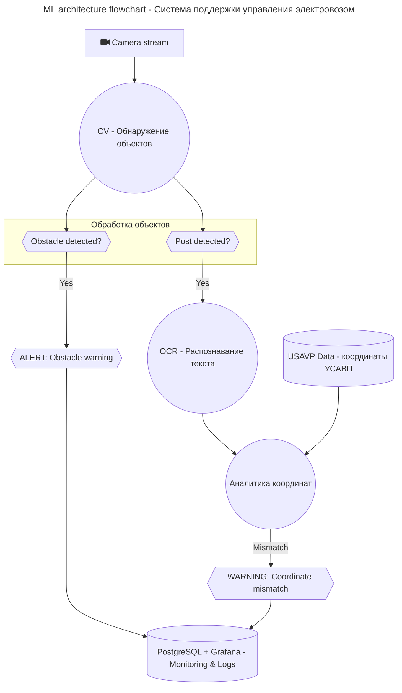

# ВАЖНО: в папке app находится прошлая реализация проекта, которая может быть неструктурированна и нефункциональна к моменту сдачи HW1

## Будет изменено в будущем

# Система поддержки принятия решений при управлении скоростным режимом электровоза

Проект разрабатывает интеллектуальную систему, которая с помощью компьютерного зрения определяет текущие координаты поезда, обнаруживает препятствия на пути и предупреждает машиниста о возможных рисках для предотвращения аварийных ситуаций.

---

## 📋 Описание проекта

Система анализирует видеопоток с камеры, установленной на электровозе, с помощью нейронных сетей:

- **Обнаружение километровых и пикетных столбиков** для определения текущей координаты.
- **Распознавание числовых значений** на столбиках через OCR (оптическое распознавание символов).
- **Обнаружение препятствий на пути** (посторонние объекты, животные, автомобили).
- **Сравнение координаты** с данными системы УСАВП.
- **Предупреждение машиниста** о расхождении координат или наличии препятствий.
- **Сбор и мониторинг данных** через PostgreSQL и Grafana.

---

## 🛠️ Стек технологий

- **Computer Vision:** YOLOv8 (обнаружение объектов) (**будет изменено**)
- **OCR:** EasyOCR (распознавание текста на столбиках) (**будет изменено**)
- **Backend:** FastAPI (асинхронное API)
- **Database:** PostgreSQL (хранение координат и аномалий)
- **Monitoring:** Grafana (отображение аномалий в реальном времени)
- **DevOps:** Docker + docker-compose (разворачивание сервисов) (**будет изменено**)
- **Hardware:** ***будет указано позже***

---

## 🧩 Архитектура проекта

---

## 🚀 Быстрый старт

1. Клонируйте репозиторий
2. Разверните приложение
**(будет изменено в будущем)**

---

## ⚙️ Основные функции API

| Метод | Эндпоинт | Описание |
|:-----:|:--------:|:-------- |
| `POST` | `/api/data/put_train` | Создать поезд |
| `POST` | `/api/data/start_trip` | Начать поездку |
| `POST` | `/api/data/put_usavp` | Загрузить данные УСАВП |
| `POST` | `/api/data/put_ml` | Загрузить координаты с камеры |
| `GET` | `/api/data/get_statistics` | Получить статистику поездки |

---

## 📈 Метрики качества

- **Точность обнаружения столбиков:** > 98%
- **Точность распознавания текста:** > 90%
- **Обнаружение препятствий:** 100% на тестовых данных
- **Среднее время обработки кадра:** ≤ 100 мс

---

## 🛡️ Безопасность

- Обработка данных локально, без передачи в облако.

---

## 💬 Контакты

**Автор проекта:** erofdmit

**По всем вопросам:** [erofeevdma@gmail.com]  
