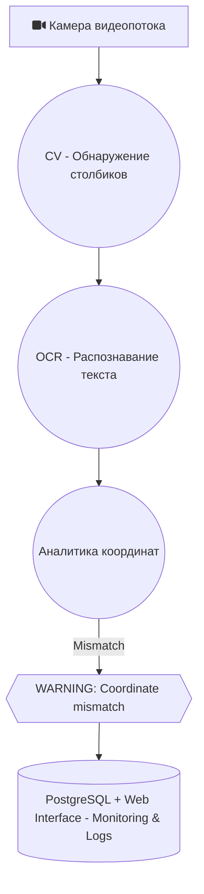

# ML System Design Doc - Система поддержки управления электровозом (MVP)

## 1. Цели и предпосылки

### 1.1. Зачем идем в разработку продукта?

- **Бизнес-цель:** Повысить безопасность и экономическую эффективность железнодорожных перевозок за счет автоматического контроля скоростного режима электровоза с использованием компьютерного зрения.
- **Почему станет лучше:** Система позволит точнее определять координаты поезда, избегать ошибок расчета километража, сократить нагрузки на тормозные системы и уменьшить аварийность.
- **Что будем считать успехом итерации:**  
  Оценка метрик по точности распознавания символов (OCR) и определению координат по столбикам ≥ 90% на тестовых данных.

### 1.2. Бизнес-требования и ограничения

- **Бизнес-требования:**  
  - Определение координаты поезда в реальном времени (10 FPS) на основе анализа километровых и пикетных столбиков.  
  - Автоматическое предупреждение машиниста в случае расхождения данных.
- **Бизнес-ограничения:**  
  - Работа в автономном режиме без подключения к внешним системам связи.
  - Минимизация затрат на внедрение и эксплуатацию.
- **Ожидания от итерации:**  
  - Прототип модели с демонстрацией на тестовом видео от заказчика через веб-интерфейс (без интеграции с УСАВП или оборудованием заказчика).
- **Бизнес-процесс пилота:**  
  - Демонстрация модели на видео заказчика, обсуждение результатов.

### 1.3. Что входит в скоуп проекта/итерации, что не входит

- **Входит в скоуп:**  
  - Распознавание километровых и пикетных столбиков.
  - Сравнение с данными УСАВП и вывод предупреждений.
- **Не входит в скоуп:**  
  - Управление движением поезда.
  - Интеграция с УСАВП.
- **Качество кода:**  
  - Асинхронное API на FastAPI с использованием SQLAlchemy.
  - Воспроизводимость окружения (Poetry, Docker), контроль качества (flake8, black, isort), трекинг экспериментов (MLflow), версионирование моделей.

### 1.4. Предпосылки решения

- Использование технологий CV и OCR для обработки видеопотока.
- Локальная работа системы с сохранением результатов в БД PostgreSQL.
- Сбор данных мониторинга локально, выгрузка специалистом на станции для последующего анализа.

## 2. Методология

### 2.1. Постановка задачи

- **Техническая задача:**  
  Обнаружение километровых и пикетных столбиков, распознавание координат для контроля скоростного режима.

### 2.2. Блок-схема решения

### 2.3. Этапы решения задачи

- **Этап 1:** Сбор и предобработка данных (~3546 изображений).
- **Этап 2:** Обучение моделей YOLO (детекция столбиков), EasyOCR (распознавание символов).
- **Этап 3:** Реализация конвейера обработки кадров через FastAPI и Docker.
- **Этап 4:** Проверка метрик на тестовых данных (Тестовая видеозапись)
- **Этап 5:** Обсуждение результатов пилота и внесение правок

## 3. Подготовка пилота

### 3.1. Способ оценки пилота

- Сравнение результатов системы с фактическими данными с видеозаписи.

### 3.2. Что считаем успешным пилотом

- Точность распознавания символов (OCR) ≥ 90%.
- Точность определения координат по столбикам ≥ 90%.
- Среднее время реакции системы < 1 секунда.
- Измеримость результатов на тестовых видео.

### 3.3. Подготовка пилота

- Демонстрация на тестовом видео заказчика через веб-интерфейс.

## 4. Внедрение

### 4.1. Архитектура решения

Камера → CV → OCR → FastAPI → PostgreSQL → Web Interface.

### 4.2. Инфраструктура и масштабируемость

- Платформа физической реализации уточняется позже.
- PostgreSQL, FastAPI, Docker.

### 4.3. Требования к работе системы

- Время обработки кадра: ≤100 мс.
- Точность OCR и определения координат ≥ 90%.

### 4.4. Безопасность системы

- Локальная работа без передачи данных.
- Система является советчиком, решение принимает человек.

### 4.5. Безопасность данных

- Локальная обработка и хранение данных.

### 4.6. Издержки

- Пилотные затраты: ~100$ аренда GPU для разработки и демонстрации.

### 4.7. Integration points

- FastAPI эндпоинты для взаимодействия с системой.
- Веб-интерфейс для демонстрации работы

### 4.8. Риски

- Снижение точности при плохой погоде.
- Ошибки при повреждении столбиков и плохой видимости.

***Риски могут привести к некорректному определению координат и ложным предупреждения.***
