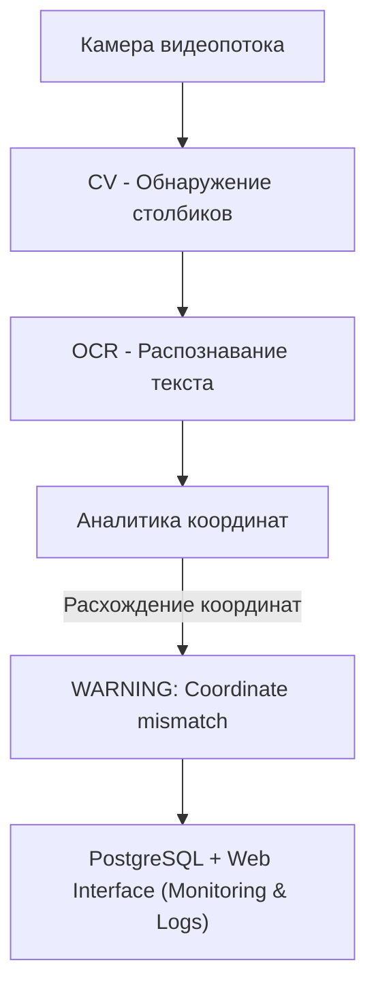

# ML System Design Doc - Система поддержки управления электровозом (MVP)

## 1. Цели и предпосылки

### 1.1. Зачем идем в разработку продукта?

- **Бизнес-цель:** Повысить безопасность и экономическую эффективность железнодорожных перевозок за счет автоматического контроля скоростного режима электровоза с использованием компьютерного зрения.
- **Почему станет лучше:** Система позволит точнее определять координаты поезда, избегать ошибок расчета километража, сократить нагрузки на тормозные системы и уменьшить аварийность.
- **Что будем считать успехом итерации:**  
  Оценка метрик по точности распознавания символов (OCR) и определению координат по столбикам ≥ 90% на тестовых данных.

### 1.2. Бизнес-требования и ограничения

- **Бизнес-требования:**  
  - Определение координаты поезда в реальном времени (10 FPS) на основе анализа километровых и пикетных столбиков.  
  - Автоматическое предупреждение машиниста в случае расхождения данных.
- **Бизнес-ограничения:**  
  - Работа в автономном режиме без подключения к внешним системам связи.
  - Минимизация затрат на внедрение и эксплуатацию.
- **Ожидания от итерации:**  
  - Прототип модели с демонстрацией на тестовом видео от заказчика через веб-интерфейс (без интеграции с УСАВП или оборудованием заказчика).
- **Бизнес-процесс пилота:**  
  - Демонстрация модели на видео заказчика, обсуждение результатов.

### 1.3. Что входит в скоуп проекта/итерации, что не входит

- **Входит в скоуп:**  
  - Распознавание километровых и пикетных столбиков.
  - Сравнение с данными УСАВП и вывод предупреждений.
- **Не входит в скоуп:**  
  - Управление движением поезда.
  - Интеграция с УСАВП.
- **Качество кода:**  
  - Асинхронное API на FastAPI с использованием SQLAlchemy.
  - Воспроизводимость окружения (Poetry, Docker), контроль качества (flake8, black, isort), трекинг экспериментов (MLflow), версионирование моделей.

### 1.4. Предпосылки решения

- Использование технологий CV (Computer Vision) и OCR (Optical Character Recognition) для обработки видеопотока с камеры.
- Система работает локально на встроенном оборудовании локомотива (например, NVIDIA Jetson Nano с GPU).
- Видеопоток поступает с высокочувствительной камеры (разрешение до 1920×1080, 25–30 FPS) в формате RTSP (H.264).
- Выходные данные: координаты и метки объектов, сохраняемые в PostgreSQL.
- Архитектура решения предполагает модульный подход (детектор объектов → OCR → аналитика координат), взаимодействие модулей через REST API (FastAPI).
- Ограничения включают автономность работы, ограниченные вычислительные ресурсы и работу в сложных условиях (низкая освещённость, плохая погода, вибрации).
- Локальный мониторинг осуществляется через Grafana.

## 2. Методология

### 2.1. Постановка задачи

Техническая задача включает следующие задачи Computer Vision:

- **Обнаружение объектов** на изображениях с помощью модели YOLO (километровые и пикетные столбики, препятствия на путях).
- **Распознавание текста** (цифровых меток) на столбиках с помощью OCR (EasyOCR или аналогичные модели).
- **Анализ данных** — сопоставление полученных координат и их сравнение с официальными данными (УСАВП) для выявления несоответствий.

### 2.2. Блок-схема решения

### 2.3. Этапы решения задачи

#### Этап 1: Сбор и предобработка данных

- Использовались видеопотоки с камер, установленных на нескольких локомотивах, всего ~5 часов видео с разными условиями (погода, освещенность).
- Кадры извлекались с частотой 1 кадр/сек, итого ~3546 изображений.
- Проводилась очистка от размытых и засвеченных кадров, удалялись дубликаты.
- Применялись аугментации (яркость, контраст, шум, повороты) и балансировка классов.
- Подготовлены OCR-фрагменты с цифрами для обучения модели распознавания текста.

#### Этап 2: Обучение моделей YOLO и EasyOCR

- YOLOv5 или YOLOv8 использовались для детекции объектов, изображения масштабировались до 640×640, обучение проводилось на GPU.
- OCR выполнялся с помощью CRNN/EasyOCR на изображениях размером 32×128 пикселей.
- Параметры обучения: Adam optimizer, learning rate scheduler, 50 эпох.
- Валидация осуществлялась на отдельном тестовом наборе (20% данных).
- Основные метрики оценки: mAP@0.5 для детекции и accuracy для OCR.

#### Этап 3: Реализация конвейера обработки кадров

- Реализован модульный пайплайн на основе Docker и FastAPI.
- Последовательность шагов: захват кадра → детекция столбиков (YOLO) → вырезка фрагментов → распознавание текста (OCR) → аналитика координат → запись результатов в PostgreSQL.
- Реализована асинхронная многопоточность для повышения производительности.

#### Этап 4: Проверка метрик на тестовых данных

- Тестирование проводилось на специальной тестовой видеозаписи от заказчика.
- Измерялись метрики: точность детекции (mAP@0.5) и OCR (символьная и построчная точность).
- Полученные результаты сопоставлялись с базовыми моделями без дообучения (предобученный YOLO, EasyOCR).

#### Этап 5: Обсуждение результатов пилота и внесение правок

- Обсуждение результатов и выявление проблемных мест в работе моделей (например, слабое распознавание мелких цифр или низкая точность при плохой погоде).
- Определение путей дальнейших улучшений: расширение датасета, улучшение аугментаций, тестирование более сложных моделей (EfficientDet, Transformer-based OCR).
- Планирование дальнейших шагов и возможных интеграций с УСАВП.

## 3. Подготовка пилота

### 3.1. Способ оценки пилота

- Сравнение результатов системы с фактическими данными с видеозаписи.

### 3.2. Что считаем успешным пилотом

- Точность распознавания символов (OCR) ≥ 90%.
- Точность определения координат по столбикам ≥ 90%.
- Среднее время реакции системы < 1 секунда.
- Измеримость результатов на тестовых видео.

### 3.3. Подготовка пилота

- Демонстрация на тестовом видео заказчика через веб-интерфейс.

## 4. Внедрение

### 4.1. Архитектура решения

Камера → CV → OCR → FastAPI → PostgreSQL → Web Interface.

### 4.2. Инфраструктура и масштабируемость

- Платформа физической реализации уточняется позже.
- PostgreSQL, FastAPI, Docker.

### 4.3. Требования к работе системы

- Время обработки кадра: ≤100 мс.
- Точность OCR и определения координат ≥ 90%.

### 4.4. Безопасность системы

- Локальная работа без передачи данных.
- Система является советчиком, решение принимает человек.

### 4.5. Безопасность данных

- Локальная обработка и хранение данных.

### 4.6. Издержки

- Пилотные затраты: ~100$ аренда GPU для разработки и демонстрации.

### 4.7. Integration points

- FastAPI эндпоинты для взаимодействия с системой.
- Веб-интерфейс для демонстрации работы

### 4.8. Риски

- Снижение точности при плохой погоде.
- Ошибки при повреждении столбиков и плохой видимости.

***Риски могут привести к некорректному определению координат и ложным предупреждения.***
