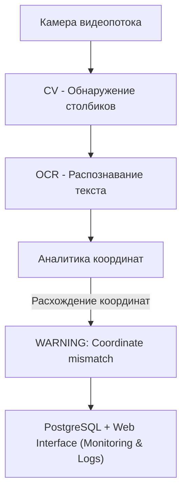

# ML System Design Doc - Система поддержки управления электровозом (MVP)

## 1. Цели и предпосылки

### 1.1. Зачем идем в разработку продукта?

- **Бизнес-цель:** Повысить безопасность и экономическую эффективность железнодорожных перевозок за счет автоматического контроля скоростного режима электровоза с использованием компьютерного зрения.
- **Почему станет лучше:** Система позволит точнее определять координаты поезда, избегать ошибок расчета километража, сократить нагрузки на тормозные системы и уменьшить аварийность.
- **Что будем считать успехом итерации:**  
  Оценка метрик по точности распознавания символов (OCR) и определению координат по столбикам ≥ 90% на тестовых данных.

### 1.2. Бизнес-требования и ограничения

- **Бизнес-требования:**  
  - Определение координаты поезда в реальном времени (10 FPS) на основе анализа километровых и пикетных столбиков.  
  - Автоматическое предупреждение машиниста в случае расхождения данных.
- **Бизнес-ограничения:**  
  - Работа в автономном режиме без подключения к внешним системам связи.
  - Минимизация затрат на внедрение и эксплуатацию.
- **Ожидания от итерации:**  
  - Прототип модели с демонстрацией на тестовом видео от заказчика через веб-интерфейс (без интеграции с УСАВП или оборудованием заказчика).
- **Бизнес-процесс пилота:**  
  - Демонстрация модели на видео заказчика, обсуждение результатов.

### 1.3. Что входит в скоуп проекта/итерации, что не входит

- **Входит в скоуп:**  
  - Распознавание километровых и пикетных столбиков.
  - Сравнение с данными УСАВП и вывод предупреждений.
- **Не входит в скоуп:**  
  - Управление движением поезда.
  - Интеграция с УСАВП.
- **Качество кода:**  
  - Асинхронное API на FastAPI с использованием SQLAlchemy.
  - Воспроизводимость окружения (Poetry, Docker), контроль качества (flake8, black, isort), трекинг экспериментов (MLflow), версионирование моделей.

### 1.4. Предпосылки решения

- Использование технологий CV (Computer Vision) и OCR (Optical Character Recognition) для обработки видеопотока с камеры.
- Система работает локально на встроенном оборудовании локомотива (например, NVIDIA Jetson Nano с GPU).
- Видеопоток поступает с высокочувствительной камеры (разрешение до 1920×1080, 25–30 FPS) в формате RTSP (H.264).
- Выходные данные: координаты и метки объектов, сохраняемые в PostgreSQL.
- Архитектура решения предполагает модульный подход (детектор объектов → OCR → аналитика координат), взаимодействие модулей через REST API (FastAPI).
- Ограничения включают автономность работы, ограниченные вычислительные ресурсы и работу в сложных условиях (низкая освещённость, плохая погода, вибрации).
- Локальный мониторинг осуществляется через Grafana.

## 2. Методология

### 2.1. Постановка задачи

Техническая задача включает следующие задачи Computer Vision:

- **Обнаружение объектов** на изображениях с помощью модели YOLO (километровые и пикетные столбики, препятствия на путях).
- **Распознавание текста** (цифровых меток) на столбиках с помощью OCR (EasyOCR или аналогичные модели).
- **Анализ данных** — сопоставление полученных координат и их сравнение с официальными данными (УСАВП) для выявления несоответствий.

### 2.2. Блок-схема решения

### 2.3. Этапы решения задачи

#### Этап 1: Сбор и предобработка данных

На этом этапе осуществляется сбор и предобработка видеоданных с камер локомотивов. Данные представлены в формате видеопотоков RTSP (H.264), всего собрано около 5 часов видеозаписей (~3546 кадров с частотой 1 кадр/сек). Видеоматериал включает различные условия съёмки: погоду, освещённость, качество изображения.

Выявленные проблемы на этапе EDA: наличие размытых и засвеченных кадров, а также дубликатов изображений. Отмечается, что текущий объём данных может быть недостаточным для уверенной работы моделей, особенно в сложных условиях (плохая видимость, мелкие объекты).

- Для решения проблемы планируется собрать дополнительные 5-10 часов видеоматериалов и применить расширенные техники аугментации, включая генерацию синтетических данных.

- Данные не содержат конфиденциальной информации и не требуют специальной обработки.

- Этап можно считать завершённым, если подготовлен и проверен очищенный набор данных, а также обеспечена балансировка классов для обучения моделей.

#### Этап 2: Обучение моделей YOLO и EasyOCR

На данном этапе происходит обучение моделей детекции объектов (YOLO) и распознавания текста (OCR). Для детекции используются метрики mAP@0.5 и стандартные функции потерь YOLO (Box Loss, Objectness Loss, Classification Loss). Для OCR используется метрика точности (accuracy) и функция потерь CTC Loss.

Разделение данных проводится по схеме 80% (обучение) и 20% (валидация). Бейзлайном являются предобученные модели YOLOv5/YOLOv8 и EasyOCR без дообучения. Изображения проходят стандартизированную предобработку (масштабирование).

- Планируется использовать более продвинутые модели (EfficientDet, Transformer-based OCR), улучшать аугментации и оптимизировать гиперпараметры. Анализируется качество работы моделей, обсуждаются выявленные проблемы с заказчиком.

- Основной риск — низкая производительность в сложных условиях, снижается за счёт расширения и балансировки данных.

- Этап можно считать завершённым при достижении метрик: mAP@0.5 ≥ 90%, accuracy OCR ≥ 90%, подтверждённых на тестовом наборе данных.

#### Этап 3: Реализация конвейера обработки кадров

Реализуется модульный конвейер обработки данных на основе Docker и FastAPI. Пайплайн включает следующие шаги: захват кадров, детекция столбиков, вырезка фрагментов, распознавание текста, аналитика координат и сохранение результатов в PostgreSQL.

Конвейер разрабатывается с использованием асинхронной и многопоточной обработки, обеспечивая обработку кадров со скоростью не более 100 мс на кадр. Результаты работы интегрируются в базу данных и доступны через веб-интерфейс.

- Основной риск на этом этапе — возможное снижение производительности при росте нагрузки. Риск снижается нагрузочным тестированием и оптимизацией системы.

- Этап можно считать завершённым, если пайплайн стабильно работает, обрабатывая видеопоток со скоростью ≤100 мс на кадр и выполняя требования по точности моделей.

#### Этап 4: Проверка метрик на тестовых данных

Проводится финальное тестирование на специально предоставленной видеозаписи от заказчика. Измеряются ключевые метрики: точность детекции объектов (mAP@0.5), а также символьная и построчная точность OCR.

Результаты сравниваются с бейзлайнами (предобученные модели YOLO, EasyOCR без дополнительного обучения) для оценки эффективности предложенных решений.

- Этап считается завершённым, когда достигаются целевые метрики (mAP@0.5 ≥ 90%, OCR accuracy ≥ 90%), подтверждённые на контрольной видеозаписи.

#### Этап 5: Обсуждение результатов пилота и внесение правок

На основе результатов тестирования обсуждаются с заказчиком выявленные проблемы, такие как недостаточная точность при плохой погоде или при распознавании мелких символов.

Определяются пути дальнейших улучшений: расширение и улучшение датасета, применение более совершенных техник аугментации, тестирование более сложных моделей (например, EfficientDet, Transformer-based OCR).

Планируется следующий шаг — интеграция полученных моделей с системой управления (УСАВП), обсуждаются возможные улучшения и будущие этапы проекта.

- Этап считается завершённым после согласования с заказчиком всех предложенных улучшений и утверждения плана дальнейших действий.

## 3. Подготовка пилота

### 3.1. Способ оценки пилота

- Сравнение результатов системы с фактическими данными с видеозаписи.

### 3.2. Что считаем успешным пилотом

- Точность распознавания символов (OCR) ≥ 90%.
- Точность определения координат по столбикам ≥ 90%.
- Среднее время реакции системы < 1 секунда.
- Измеримость результатов на тестовых видео.

### 3.3. Подготовка пилота

- Демонстрация на тестовом видео заказчика через веб-интерфейс.

## 4. Внедрение

### 4.1. Архитектура решения

Камера → CV → OCR → FastAPI → PostgreSQL → Web Interface.

### 4.2. Инфраструктура и масштабируемость

- Платформа физической реализации уточняется позже.
- PostgreSQL, FastAPI, Docker.

### 4.3. Требования к работе системы

- Время обработки кадра: ≤100 мс.
- Точность OCR и определения координат ≥ 90%.

### 4.4. Безопасность системы

- Локальная работа без передачи данных.
- Система является советчиком, решение принимает человек.

### 4.5. Безопасность данных

- Локальная обработка и хранение данных.

### 4.6. Издержки

- Пилотные затраты: ~100$ аренда GPU для разработки и демонстрации.

### 4.7. Integration points

- FastAPI эндпоинты для взаимодействия с системой.
- Веб-интерфейс для демонстрации работы

### 4.8. Риски

- Снижение точности при плохой погоде.
- Ошибки при повреждении столбиков и плохой видимости.

***Риски могут привести к некорректному определению координат и ложным предупреждения.***
