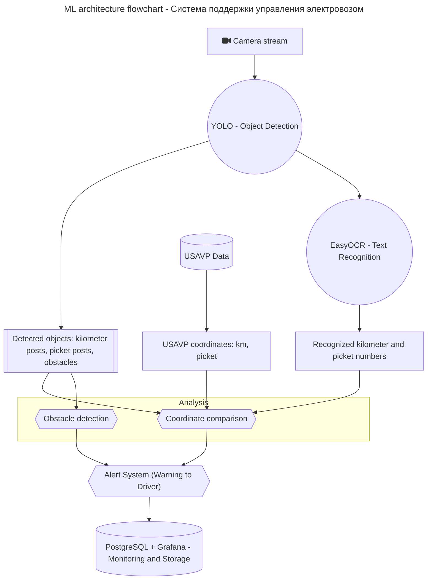

# ML System Design Doc - Система поддержки управления электровозом (MVP)

## 1. Цели и предпосылки

### 1.1. Зачем идем в разработку продукта?

- **Бизнес-цель:** Повысить безопасность и экономическую эффективность железнодорожных перевозок за счет автоматического контроля скоростного режима электровоза с использованием компьютерного зрения.
- **Почему станет лучше:** Система позволит точнее определять координаты поезда, избегать ошибок расчета километража, сократить нагрузки на тормозные системы и уменьшить аварийность.
- **Что будем считать успехом итерации:**  
  Система успешно выявляет расхождения между фактической и расчетной координатами поезда **и обнаруживает препятствия на пути** с точностью 98%+ при тестировании.

### 1.2. Бизнес-требования и ограничения

- **Бизнес-требования:**  
  - Определение координаты поезда в реальном времени на основе анализа километровых и пикетных столбиков.  
  - **Обнаружение препятствий на пути ЖД состава в режиме реального времени.**
  - Автоматическое предупреждение машиниста в случае расхождения данных или обнаружения препятствия.
- **Бизнес-ограничения:**  
  - Работа в автономном режиме без стабильного подключения к внешним системам связи.
  - Минимизация затрат на внедрение и эксплуатацию.
- **Ожидания от итерации:**  
  - Прототип, интегрированный с системами УСАВП.
- **Бизнес-процесс пилота:**  
  - Интеграция системы в процессы управления локомотивом; пилотное тестирование на реальных маршрутах.
- **Что считаем успешным пилотом:**  
  - Точность распознавания объектов ≥ 98%,  
  - Снижение количества аварийных ситуаций, связанных с неправильным расчетом координат.

### 1.3. Что входит в скоуп проекта/итерации, что не входит

- **Входит в скоуп:**  
  - Распознавание километровых и пикетных столбиков.
  - Сравнение с данными УСАВП и вывод предупреждений.
  - **Обнаружение препятствий на железной дороге (животные, машины, посторонние предметы).**
- **Не входит в скоуп:**  
  - Управление движением поезда (система только предупреждает машиниста).
- **Качество кода:**  
  - Асинхронное API на FastAPI с использованием SQLAlchemy для работы с базой данных.
- **Технический долг:**  
  - Оптимизация скорости обработки изображений.

### 1.4. Предпосылки решения

- Использование технологий YOLO и EasyOCR для обработки видеопотока с камеры.
- Система работает локально.
- Использование базы данных PostgreSQL и мониторинга через Grafana.

## 2. Методология

### 2.1. Постановка задачи

- **Техническая задача:**  
  Обнаружение километровых и пикетных столбиков на изображениях, распознавание координат, **обнаружение препятствий на пути поезда** для контроля скоростного режима и предотвращения ЧС.

### 2.2. Блок-схема решения

Верхнеуровневая рхитектура

### 2.3. Этапы решения задачи

- **Этап 1 - Подготовка данных:**  
  - Сбор и разметка изображений километровых и пикетных столбиков (~3546 изображений).
  - Предобработка изображений (суперразрешение, коррекция контраста).
- **Этап 2 - Обучение моделей:**  
  - Обучение модели YOLO на обнаружение объектов и препятствий.  
  - Обучение EasyOCR на распознавание чисел.
- **Этап 3 - Интеграция моделей:**  
  - Реализация конвейера обработки кадров через FastAPI и Docker.
- **Этап 4 - Сравнение с УСАВП:**  
  - Проверка координаты поезда.
  - Отправка предупреждений при расхождении данных или обнаружении препятствий.
- **Этап 5 - Мониторинг:**  
  - Визуализация результатов работы через Grafana.

## 3. Подготовка пилота

### 3.1. Способ оценки пилота

- Сбор данных о срабатывании системы предупреждения.
- Сравнение с реальными координатами поезда.

### 3.2. Что считаем успешным пилотом

- Количество ошибок обнаружения < 2% на тестовом маршруте.
- Среднее время реакции системы < 1 секунда.
- 100% обнаружение всех препятствий на пути на тестовых маршрутах.

### 3.3. Подготовка пилота

- Тестирование на видеозаписях с реальных электровозов.

## 4. Внедрение

### 4.1. Архитектура решения

- Камера → YOLO (обнаружение столбиков и препятствий) → EasyOCR → FastAPI → PostgreSQL → Grafana.

### 4.2. Инфраструктура и масштабируемость

- Платформа: **будет рассчитана позже**.
- База данных: PostgreSQL.
- Мониторинг: Grafana.

### 4.3. Требования к работе системы

- Время обработки одного кадра: до 100 мс.
- Точность распознавания символов: > 90%.

### 4.4. Безопасность системы

- Автономная работа без передачи данных в облако.

### 4.5. Безопасность данных

- Данные обрабатываются локально;
  
### 4.6. Издержки

- Оценочные затраты: 300-500$ на устройство и 100$ в месяц на поддержку.

### 4.7. Integration points

- FastAPI эндпоинты для загрузки и получения данных о поездках.

### 4.8. Риски

- Ошибки распознавания при плохой погоде.
- Повреждение столбиков, плохая видимость знаков.
- Ложные срабатывания при обнаружении препятствий.
